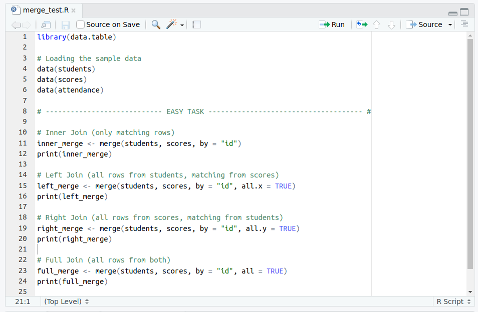
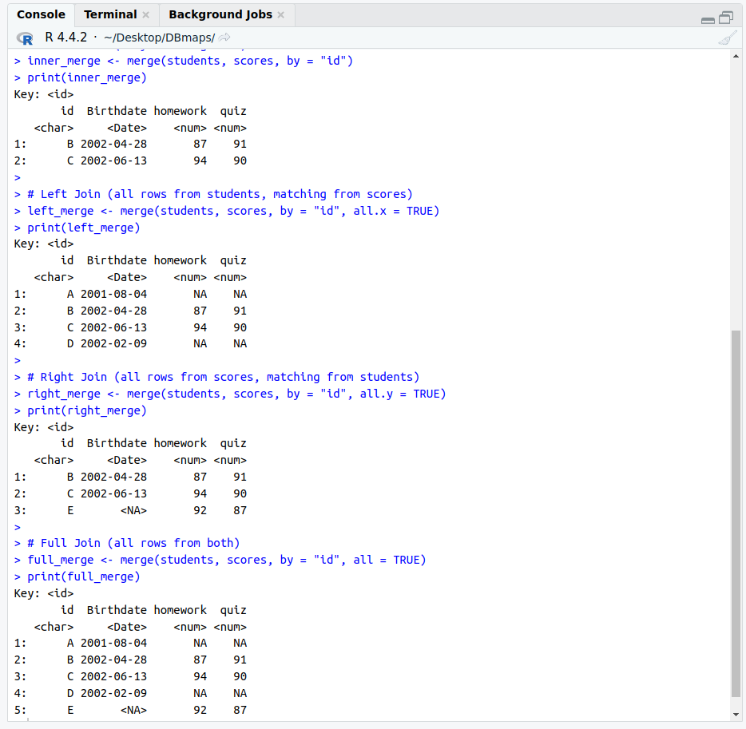
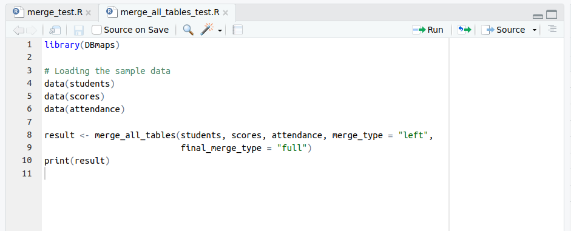
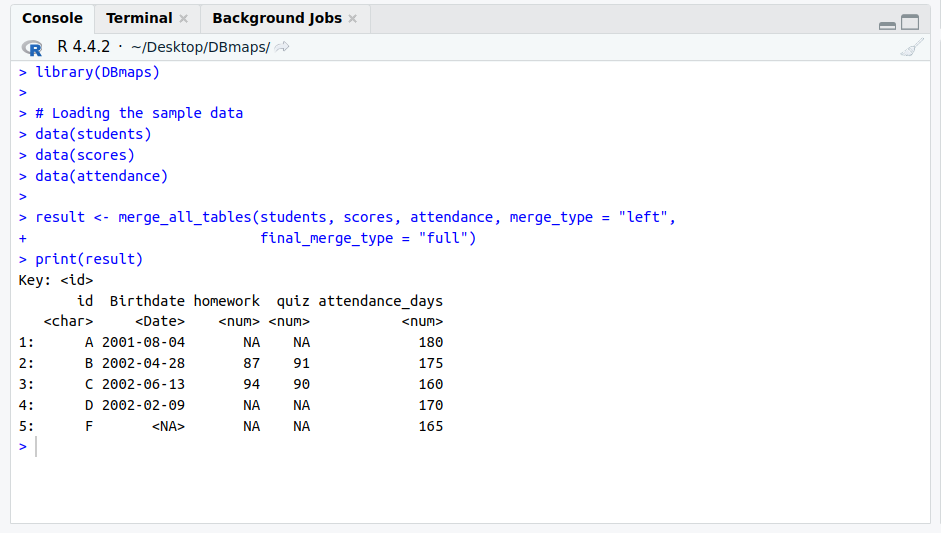

# Task Completion Report

## Easy Task

The code used for performing these merges is shown below:



The results obtained from these merges are as follows:



---

## Medium Task

A function was written to merge tables `x` and `y` and then merge this combined table with another table `z`.
The function includes relevant parameters to ensure flexibility.

The code for this function is shown below:



The results obtained from executing this function are as follows:



---

## Hard Task

As part of the hard task, a package named `DBmaps` was developed. This package contains:
- Data and corresponding documentation
- Functions and their respective documentation
- Unit tests
- Vignettes for usage demonstration

The package can be installed and tested using the following command:

```r
devtools::install_github("I-am-Sagar/DBmaps", build_vignettes = TRUE)
```

The package is available at [DBmaps GitHub Repository](https://github.com/I-am-Sagar/DBmaps).

---